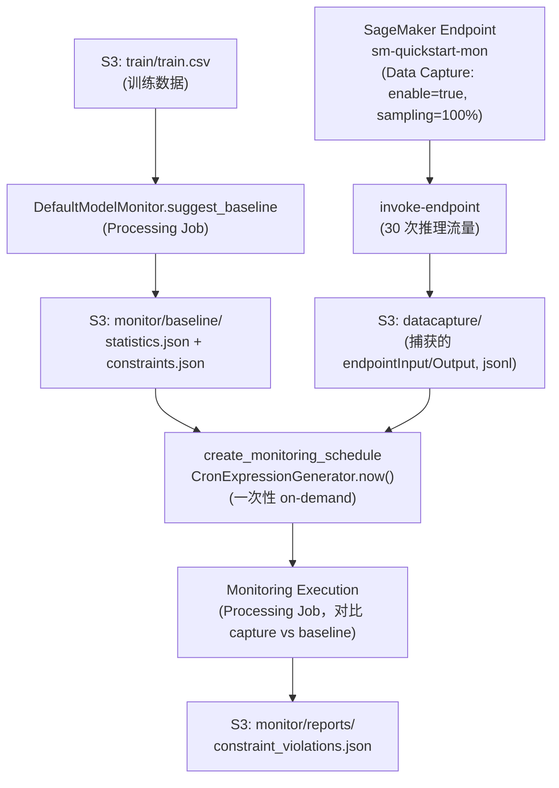
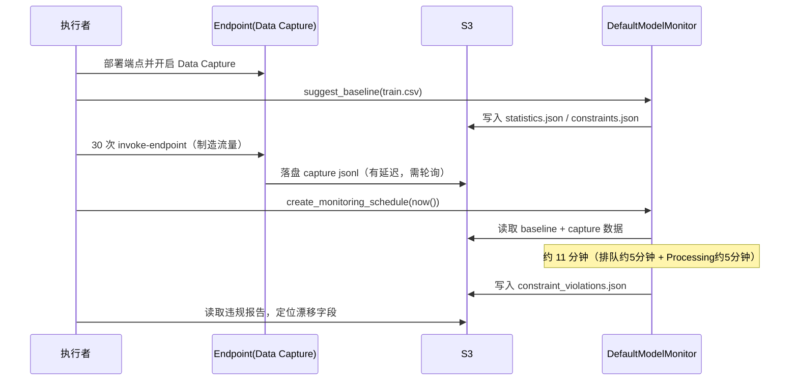
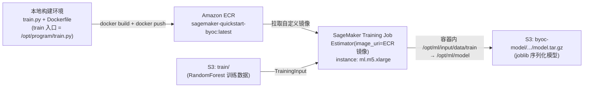
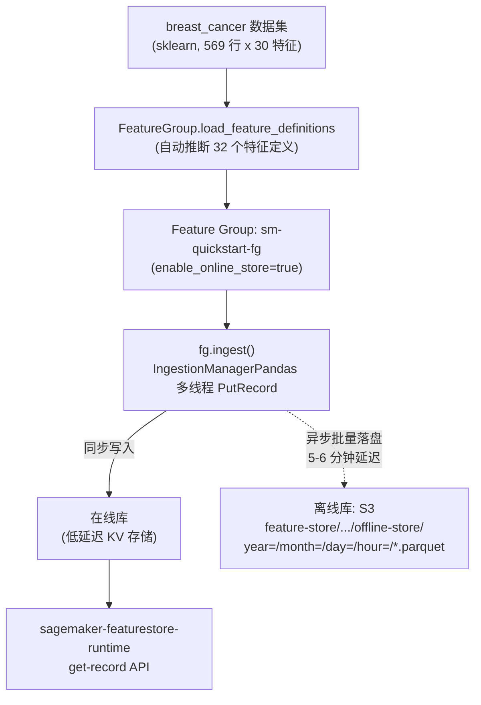
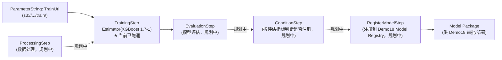
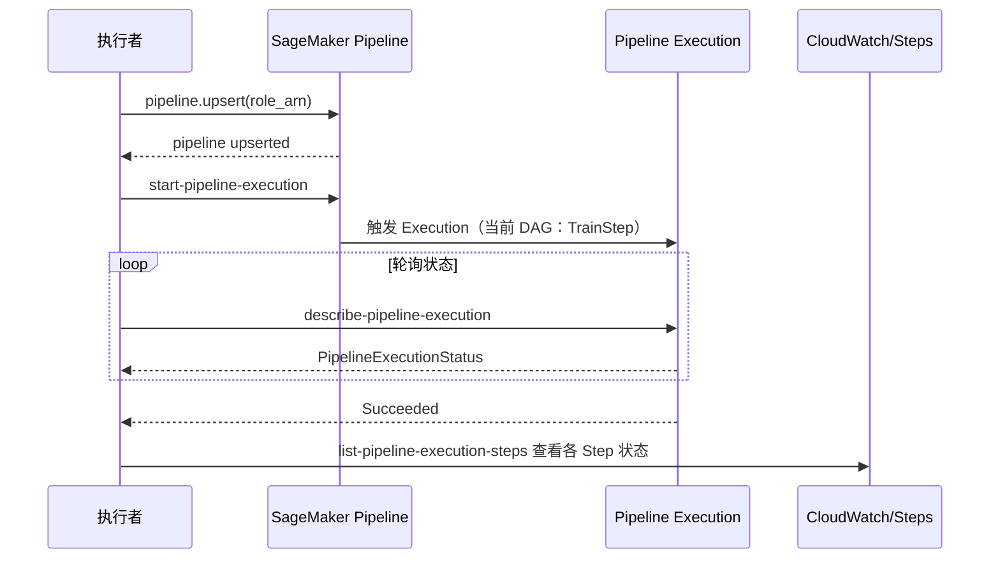
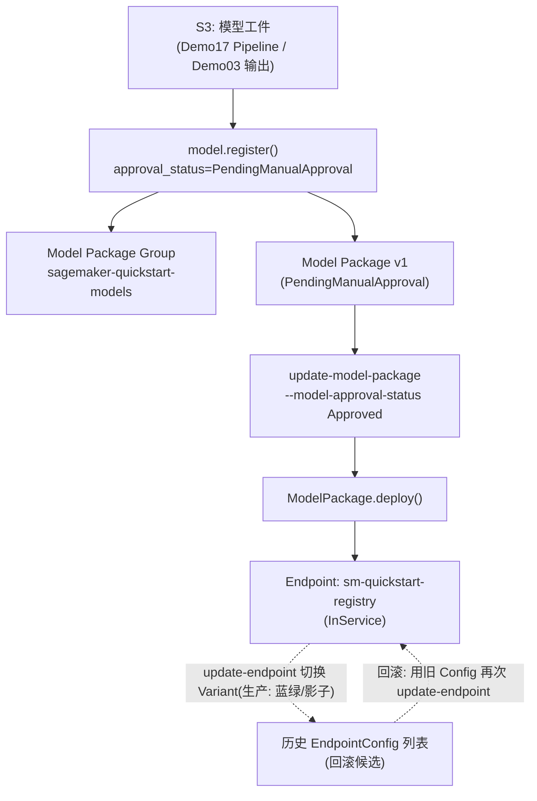
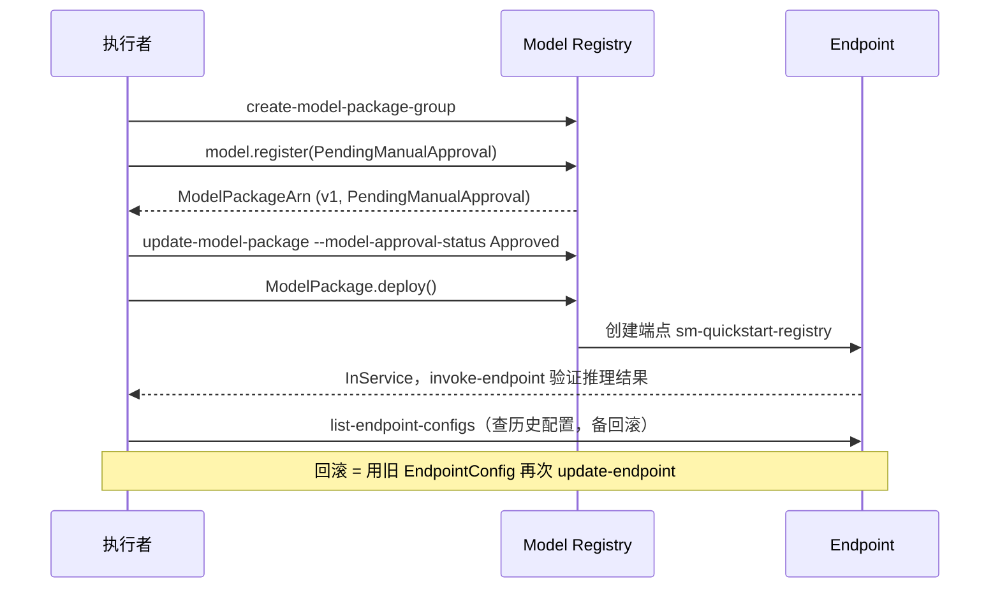

# 架构文档

本仓库包含 20 个 Demo，这里不做全量架构图汇总，只对其中组件交互较复杂、值得可视化的 Demo 提供架构图；其余 Demo 请直接看对应的 `docs/demoXX-*.md`。

以下 5 个 Demo 涉及多组件编排、异步作业链路、自定义镜像集成或多阶段状态流转，复杂度明显高于其余以"创建单个资源 + 调用验证"为主的 Demo，因此单独画图：

- **Demo13 — Model Monitor 数据漂移检测**：端点 Data Capture + 训练数据建 baseline + Processing 作业做监控执行的多阶段异步链路
- **Demo14 — BYOC 自带容器**：本地构建镜像 → ECR 推送 → SageMaker 按容器契约调度训练的完整链路
- **Demo16 — Feature Store 特征存储**：同一份特征定义拆分到在线（低延迟）/离线（S3 Parquet）两条并行存储链路
- **Demo17 — SageMaker Pipelines**：Processing/Training/Evaluation/Condition/RegisterModel 串联成 DAG 的流水线编排
- **Demo18 — Model Registry 与蓝绿/影子部署**：模型版本审批状态机 + 从 Registry 部署端点 + 历史 EndpointConfig 回滚

---

## Demo13 — Model Monitor 数据漂移检测

为 Demo04 的端点开启 Data Capture，用训练数据建立 baseline 统计量与约束，再用 on-demand 方式手动触发一次监控作业，检测线上流量与训练数据的分布漂移。关键点：定时 Monitoring Schedule 最小粒度为每小时，演示走 `CronExpressionGenerator.now()` 的一次性执行路径（实测约 11 分钟：排队 + Processing 作业）。

---

## Demo14 — BYOC 自带容器

当内置算法与框架容器都不满足需求时，BYOC 是终极的灵活性出口：本地编写符合 SageMaker 容器契约（`train` 入口 + `/opt/ml/` 目录约定）的 Dockerfile，构建镜像推送到 ECR，SageMaker Training Job 直接引用该 ECR 镜像调度训练，产出模型工件写回 S3。

> ⚠️ 训练/推理镜像的依赖版本必须锁定一致（如 `scikit-learn==1.7.2`），否则跨镜像 `joblib.load` 反序列化可能失败——生产 BYOC 的常见坑点。

---

## Demo16 — Feature Store 特征存储

建立同时开启在线库与离线库的 Feature Group：在线库供实时推理低延迟取特征，离线库（S3 Parquet，Hive 分区）供训练批量取特征，二者共享同一份特征定义（32 个特征 + record_id + event_time），从根源上避免训练服务偏差。

---

## Demo17 — SageMaker Pipelines 模型流水线

用 SageMaker Pipelines 把数据处理、训练、评估、条件注册串成一条可重复执行、可参数化、可追溯的 DAG，替代手工串联多个 Demo 的步骤。下图为完整流水线的目标形态（Processing → Training → Evaluation → Condition → RegisterModel）；当前 Demo 已跑通验证的是最小化的单 TrainingStep（`ParameterString` 化训练数据路径），其余 Step 类型待在此基础上扩展。

---

## Demo18 — Model Registry 与蓝绿/影子部署

用 Model Package Group 管理模型版本，经过审批状态机（`PendingManualApproval` → `Approved`）后直接从 Registry 部署端点，并演练基于历史 EndpointConfig 的回滚路径。蓝绿/影子（`ShadowProductionVariants`）为生产上线路径示意。

